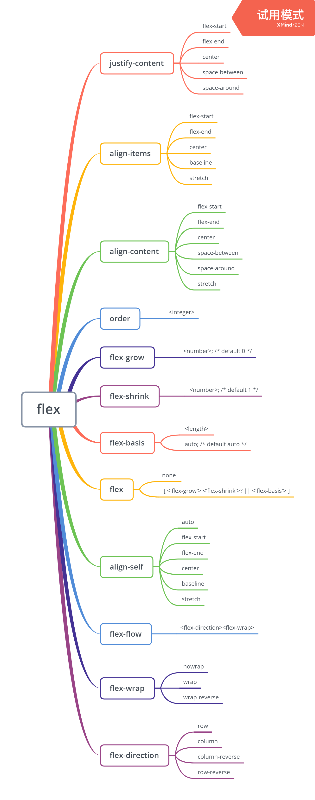

## flex布局

`flex` 是一个CSS的[`display`](https://developer.mozilla.org/zh-CN/docs/Web/CSS/display) 属性中新添加一个值。 随着`inline-flex`的使用，它将使它适用的元素成为一个[flex container](https://developer.mozilla.org/en-US/docs/Glossary/flex_container)（伸缩容器），而这个元素的每个子元素将成为 [flex item](https://developer.mozilla.org/en-US/docs/Glossary/flex_item)（伸缩项目）。伸缩项目将参与到flex布局中，所有由CSS Flexible Box Layout Module（CSS伸缩盒布局模型）定义的属性都能被它们使用。

