# Jenkins 是什么?
Jenkins是一款开源 CI&CD 软件，用于自动化各种任务，包括构建、测试和部署软件。
## 安装jenkins
 首先安装java依赖包
 ```
 yum install java
 ```
 添加jenkins源
 ```
 wget -O /etc/yum.repos.d/jenkins.repo http://pkg.jenkins-ci.org/redhat/jenkins.repo
rpm --import https://jenkins-ci.org/redhat/jenkins-ci.org.key
 ```
 ```
 yum install jenkins
 ```
 ## 配置

 jenkins修改权限
 ```
vim /etc/sysconfig/jenkins
 ```
 找到$JENKINS_USER 改为 “root”:

 ## 启动jenkins
 ```
 service jenkins start
 ```
 然后在浏览器输入你的ip:8080就可以看到解锁页面（如果启动成功但是不能访问，可能是安全组规则没配置配置，还有防火墙的原因，百度解决）

 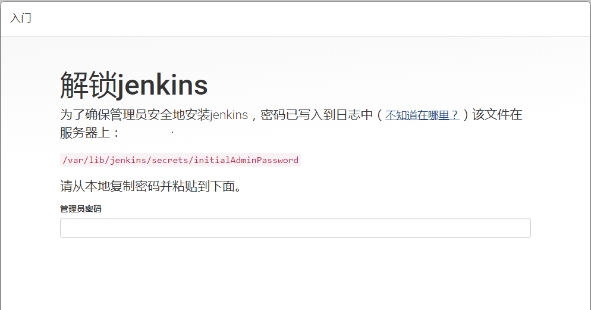

 然后会叫我们输入管理员密码，页面上会有提示指定文件，我们用vim打开
 ```
 vim /var/lib/jenkins/secrets/initialAdminPassword
 ```
 然后复制密码到输入框执行下一步
 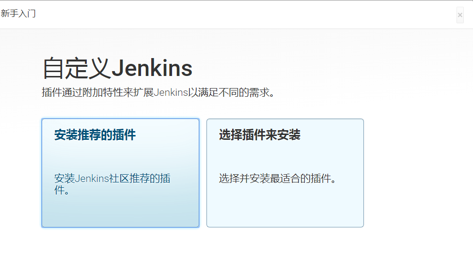
 选择安装推荐的插件即可（可能有的人插件安装失败，可以后面解决）
 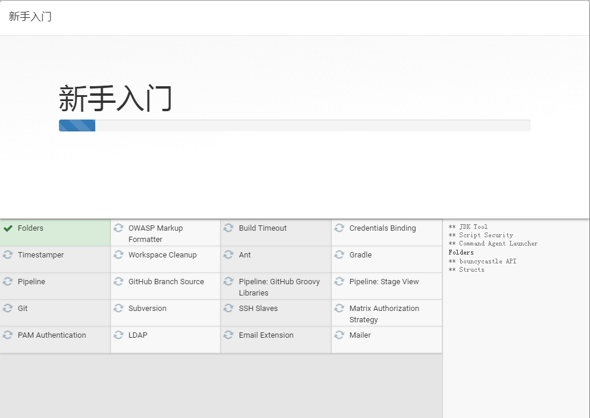
 创建管理员用户
  
  填好之后下一步就好了，开始使用jenkins

## 插件安装失败处理

  我们在（系统管理-插件管理-高级标签页）替换升级站点为：http://mirror.xmission.com/jenkins/updates/update-center.json 提交就可以了，然后重新安装插件
  .jpg) 

## 创建任务

  新建jenkins任务

  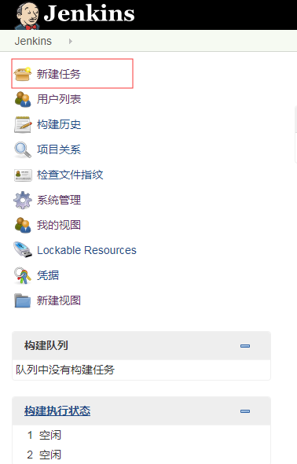

  创建一个自由风格的软件项目

  .jpg)


  ## 实现git钩子
 我们初始化一个项目，react/vue都可以，我这里使用的react

 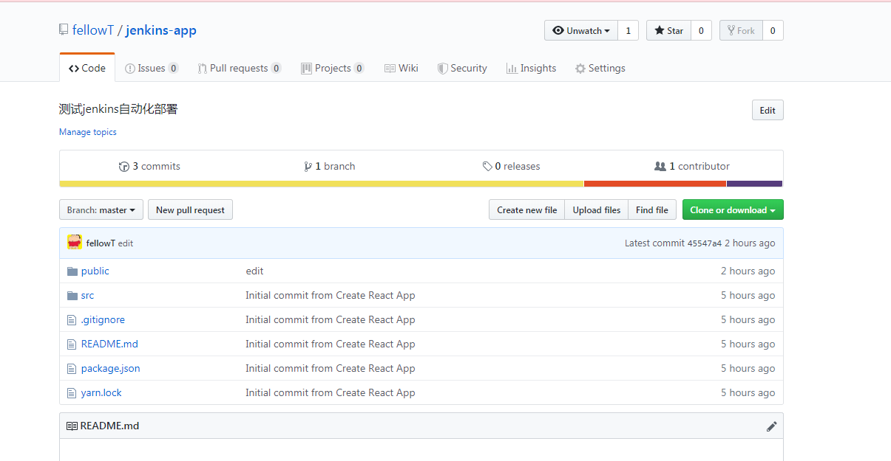

1、打开刚创建的任务，选择配置，添加远程仓库地址，配置登录名及密码及分支。

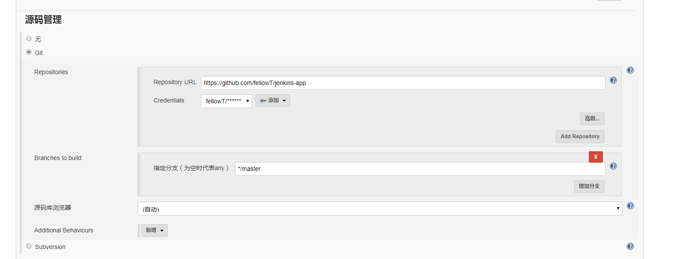

2、安装Generic Webhook Trigger Plugin插件

该插件功能很强大，可以根据不同的触发参数触发不同的构建操作，比如我向远程仓库提交的是master分支的代码，就执行代码部署工作，我向远程仓库提交的是某个feature分支，就执行单元测试，单元测试通过后合并至dev分支。灵活性很高，可以自定义配置适合自己公司的方案，这里方便演示我们不做任何条件判断，只要有提交就触发。在任务配置里勾选Generic Webhook Trigger即可

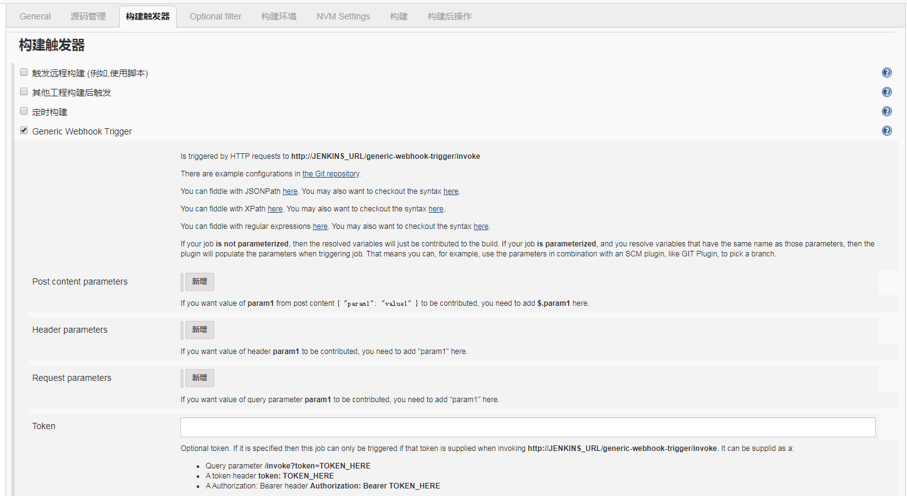

3、仓库配置钩子，当本地向远端仓库发起push时，远端仓库会向配置的Jenkins服务器的接口地址发起一个带参数的请求，jenkins收到后开始工作


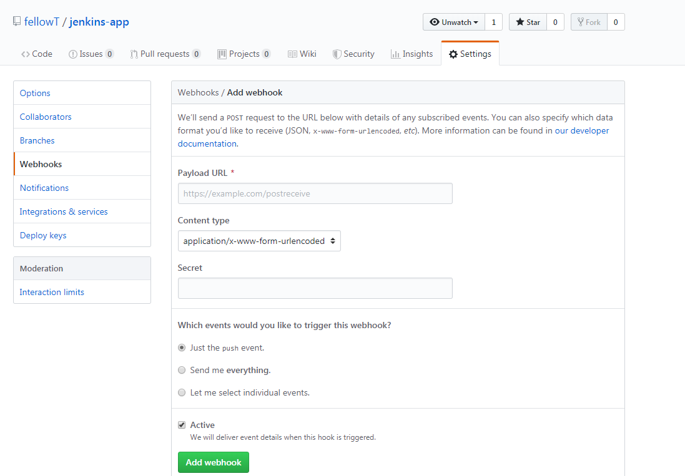

URL格式为 http://<User ID>:<API Token>@<Jenkins IP地址>:端口/generic-webhook-trigger/invoke
userid和api token在jenkins的系统管理-管理用户-admin-设置里，你可以新增token

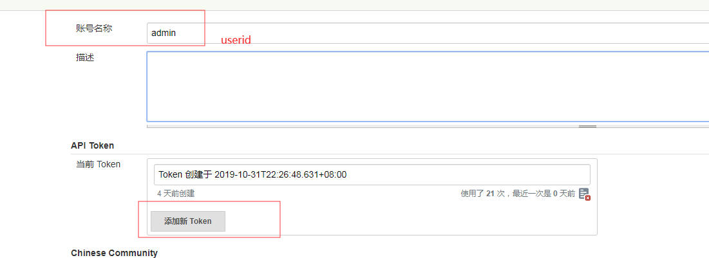

Jenkins IP地址和端口是你部署jenkins服务器的ip地址，端口号没改过的话就是8080。
密码填你和上面userid对应的密码
填完之后点击add webhook，下面就会出现记录,显示绿色的√就是没问题，你可以点击Redeliver再次递交代码,或者修改本地代码git push测试一下

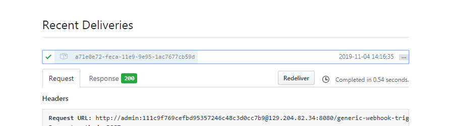

如果没问题，你的Jenkins左侧栏构建执行状态里将会出现一个任务

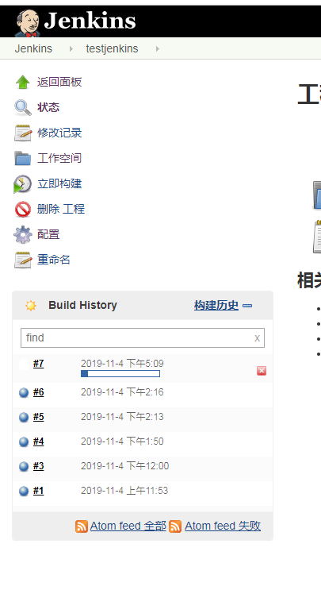

## 实现自动化构建
当我们git push触发钩子之后，jenkins就开始工作了，我们可以配置node环境，然后安装依赖-->打包
```
npm install
npm run build
```
1、安装nvm wrappe插件使用node环境

2、打开我们我们的任务配置，点击构建环境，勾选这个，并填写一个node版本（可以查看自己本地node版本）

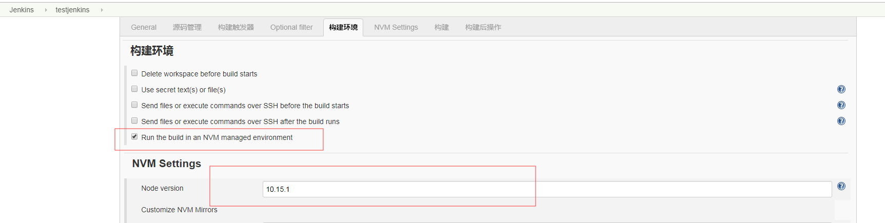

3、点击构建，输入要执行的命令

.jpg)

4、保存，然后你可以修改下本地代码git push测试一下，也可以在github中点击Redeliver再次递交代码

5、查看jenkins任务，如果成功了,点击项目的工作空间，将会发现多了build和node_modules两个文件夹。

.jpg)

## 实现自动化部署
自动化部署才是我们最需要的，我们只要git push，然后jenkins就会帮我们自动部署
我们只需要在之前的执行命令后面加这几行命令就可以了
```
tar czvf build.tar.gz * && 
mv -f build.tar.gz /root/www/pc &&
cd /root/www/pc &&
tar -xzvf build.tar.gz &&
rm -rf build.tar.gz

```
 /root/www/pc是我放项目的目录（可以通过nginx配置）

.jpg)

点击保存之后我们可以测试一下，当构建完成时，我们就可以在服务器目录/root/www/pc下看到打包后的文件,并且用我们的域名就可以访问了

.jpg)
.jpg)