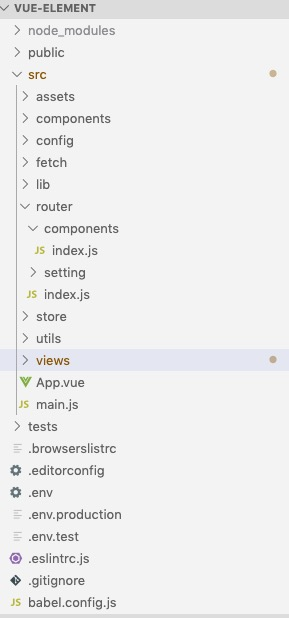

#### 一键生成.vue文件模板

我们借用vscode自带的功能

```js
文件 -> 首选项 -> 用户代码片段 -> 点击新建代码片段 -> 取名vue.json 确定
```

编辑自己写的.vue模板，进行保存

```json
{
  "Print to console": {
    "prefix": "vue",
    "body": [
      "<!-- $0 -->",
      "<template>",
      "  <div></div>",
      "</template>",
      "",
      "<script>",
      "export default {",
      "  components: {},",
      "",
      "  data () {",
      "    return {",
      "    }",
      "  },",
      "",
      "  computed: {},",
      "",
      "  created () {},",
      "",
      "  methods: {}",
      "}",
      "",
      "</script>",
      "<style lang='scss' scoped>",
      "",
      "</style>"
  ],
    "description": "Log output to console"
  }
}
```

我们新建.vue文件，在首行输入vue按键盘Enter就可以了


#### 重置data或者获取data初始值

```javascript
this.$data //获取当前状态的data
this.$options.data() //获取该组件初始化状态下的data
Object.assign(this.$data,this.$options.data()) //重置data
```


####  强制刷新组件

```javascript
this.$forceUpdate() //迫使 Vue 实例重新渲染。注意它仅仅影响实例本身和插入插槽内容的子组件，而不是所有子组件。

/*
  强制替换元素/组件而不是重复使用它。当你遇到如下场景时它可能会很有用：
  完整地触发组件的生命周期钩子
  触发过渡
*/
<Component :key="key"/>
data(){
  return{
      key:0
  }
}
//刷新key达到刷新组件的目的
key++;
```


#### 长列表优化

当我们遇到很多的数据展示且不需要响应式变化时，我们就可以使用[Object.freeze](https://developer.mozilla.org/zh-CN/docs/Web/JavaScript/Reference/Global_Objects/Object/freeze)进行优化；

**`Object.freeze()`** 方法可以**冻结**一个对象。一个被冻结的对象再也不能被修改；

当我们把一个对象传给实例的data，Vue会使用`Object.defineProperty`把这些属性响应式，使用了 [Object.freeze](https://developer.mozilla.org/zh-CN/docs/Web/JavaScript/Reference/Global_Objects/Object/freeze)之后，不仅可以减少 `observer` 的开销，还能减少不少内存开销，Vue有人提了相关[issue](https://github.com/vuejs/vue/issues/4384)

```javascript
this.list = Object.freeze(Object.assign({}, this.list))
```


#### $attrs和$listeners的使用场景

```javascript
A -> B -> C
$attrs //跨组件传值 A传值给C 在B组件上写上 v-bind="$attrs"
$listeners //跨组件执行事件 在C执行emit传值给A组件 在B组件上写上 v-on="$listeners"
一般在对UI组件进行二次封装时，只写上常用的一些属性跟方法，然后写上$attrs和$listners，我们使用组件时就可以直接使用原组件的属性跟方法
```


#### .sync修饰符

因为vue带来的双向绑定给开发带来了便利，同时也带来了代码维护上的问题，我们可以在子组件直接修改父组件穿的prop，新版本直接修改会报warn,推荐以 `update:myPropName` 的模式触发事件取而代之

```vue
<text-document v-bind:title.sync="msg"></text-document>
//等同于
<text-document v-bind:title="value => msg = value"></text-document>

//子组件更新
this.$emit('update:title', newTitle)
```

#### 自定义组件的 `v-model` [文档](https://cn.vuejs.org/v2/guide/components-custom-events.html#自定义组件的-v-model)

一个组件上的 `v-model` 默认会利用名为 `value` 的 prop 和名为 `input` 的事件，但是像单选框、复选框等类型的输入控件可能会将 `value` 特性用于[不同的目的](https://developer.mozilla.org/en-US/docs/Web/HTML/Element/input/checkbox#Value)。`model` 选项可以用来避免这样的冲突：

```
Vue.component('base-checkbox', {
  model: {
    prop: 'checked',
    event: 'change'
  },
  props: {
    checked: Boolean
  },
  template: `
    <input
      type="checkbox"
      v-bind:checked="checked"
      v-on:change="$emit('change', $event.target.checked)"
    >
  `
})
```

```
<base-checkbox v-model="lovingVue"></base-checkbox>
```

这里的 `lovingVue` 的值将会传入这个名为 `checked` 的 prop。同时当 `触发一个 `change` 事件并附带一个新的值的时候，这个 `lovingVue` 的属性将会被更新。

#### 自动引入route文件

当我们项目比较大的时候，我们就会把路由文件根据不同的业务模块拆分



每个子模块导出一个路由配置数组

```javascript
export default [
  {
    path: '/home/welcome',
    name: 'home',
    component: () => import(/* webpackChunkName: "home" */ '@/pages/home/index.vue')
  }
]

```

我们现在要实现的是每增加一个模块自动引入，我们借用`webpack`的`api`[require.context](https://webpack.js.org/guides/dependency-management/#requirecontext)

```javascript
//router/index.js
import Vue from 'vue'
import Router from 'vue-router'
Vue.use(Router)
let routes = []
const routerContext = require.context('./', true, /index\.js$/)
routerContext.keys().forEach(route => {
  if (route.startsWith('./index')) return
  const routerMoudle = routerContext(route).default || routerContext(route)
  routes = [...routes, ...routerMoudle]
})

export default new Router({
  mode: 'history',
  base: process.env.BASE_URL,
  routes: routes
})

```


#### 更新缓存的组件

使用vue的生命周期函数[activated](https://cn.vuejs.org/v2/api/#activated)

```js
 它在keep-alive 组件激活时调用。
 该钩子在服务器端渲染期间不被调用。
```


####  watch的高级用法

1.当我们watch一个值时，第一次不会指向，只有值发生变化时才会执行，此时需要我们将immediate设为true

2.普通的watch方法无法无法监听对象内部属性的改变，我们把deep设为true时就能进行深度监听了

```javascript
new Vue({
  el: '#app',
  data: {
    obj: { name: '蜡笔小新'}
  },
  watch: {
    obj: {
      handler(newName, oldName) {       },
      deep: true,
      immediate: true
    }
  } 
})

```


#### 异步数据传值给子组件

这是新手都会遇到的问题，父组件异步获取数据传给子组件，子组件拿不到值，下面是我平时的解决方案

```js
在子组件使用watch监听prop
```

or

```javascript
在父组件的data上定义一个Boolean值为flag:false，在使用的子组件时写上v-if="flag",当异步数据获取到时，把flag改成true
```


#### 巧用slot

插槽是一个很好用的api


#### 开发插件

Vue.js 的插件应该暴露一个 `install` 方法。这个方法的第一个参数是 `Vue` 构造器，第二个参数是一个可选的选项对象：

```javascript
//MyPlugin.js
MyPlugin.install = function (Vue, options) {
  // 1. 添加全局方法或属性
  Vue.myGlobalMethod = function () {
    // 逻辑...
  }

  // 2. 添加全局资源
  Vue.directive('my-directive', {
    bind (el, binding, vnode, oldVnode) {
      // 逻辑...
    }
    ...
  })

  // 3. 注入组件选项
  Vue.mixin({
    created: function () {
      // 逻辑...
    }
    ...
  })

  // 4. 添加实例方法
  Vue.prototype.$myMethod = function (methodOptions) {
    // 逻辑...
  }
}
//main.js
Vue.use(MyPlugin)
```

然后在main.js引入， 通过全局方法 `Vue.use()` 使用插件,查看[vue文档](https://cn.vuejs.org/v2/guide/plugins.html)


#### ref

`ref` 被用来给元素或子组件注册引用信息。引用信息将会注册在父组件的 `$refs` 对象上。如果在普通的 DOM 元素上使用，引用指向的就是 DOM 元素；如果用在子组件上，引用就指向组件实例

在操作dom的时候尽量使用ref去获取，因为它只作用于当前组件，而不是使用queryselector等全局选择器造成意外的bug

```html
<p ref="p">hello</p> 
<child-component ref="child"></child-component>
```


#### hook

这是一个文档中没有的api

#### 一些不常用却很牛逼的api

##### [Vue.observable( object )](https://cn.vuejs.org/v2/api/#Vue-observable)

让一个对象可响应。Vue 内部会用它来处理 `data` 函数返回的对象。

##### [v-pre](https://cn.vuejs.org/v2/api/#v-pre)

跳过这个元素和它的子元素的编译过程。可以用来显示原始 Mustache 标签。跳过大量没有指令的节点会加快编译。

```vue
<span v-pre>{{ this will not be compiled }}</span>
```

##### [v-cloak](https://cn.vuejs.org/v2/api/#v-cloak)

这个指令保持在元素上直到关联实例结束编译。和 CSS 规则如 `[v-cloak] { display: none }` 一起用时，这个指令可以隐藏未编译的 Mustache 标签直到实例准备完毕。

当网络较慢，网页还在加载 Vue.js ，而导致 Vue 来不及渲染，这时页面就会显示原始 Mustache 标签。我们可以使用 v-cloak 指令来解决这一问题。

```html
<div v-cloak>
  {{ message }}
</div>
```

```css
[v-cloak] {
  display: none;
}

```

##### [v-once](https://cn.vuejs.org/v2/api/#v-once)

只渲染元素和组件一次。随后的重新渲染，元素/组件及其所有的子节点将被视为静态内容并跳过。这可以用于优化更新性能

```html
<span v-once>This will never change: {{msg}}</span>
```

#### 总结

学习技术就是多水群多刷掘金，你就会知道自己多菜！！！！！然后偷偷去学习大神的技术